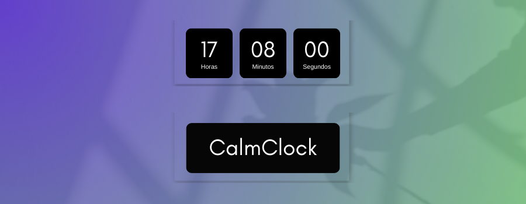

## 💻 Sobre este projeto
CalmClock é um projeto modesto, porém bastante bonito e profundo, que pode ser utilizado como fundo de tela. Foi baseado em um projeto já existente que pode ser visto [clicando aqui](https://www.youtube.com/watch?v=GK0ok3ZCXwM&pp=ygUNY2FsbWNsb2NrIGNzcw%3D%3D).

Foi possível solidificar conhecimentos sobre a troca de dados entre arquivos HTML5 em JavaScript através de métodos, funções e arrays, além de aprender e utilizar novos conhecimentos em CSS3:

#### Exemplo:
~~~javascript
const hours = document.getElementById('hours');
const minutes = document.getElementById('minutes');
const seconds = document.getElementById('seconds');
~~~

## 🎨 Layout
No projeto, utilizando bibliotecas do JavaScript e CSS, é possível observar:
* Horas, minutos e segundos
* Que dia é hoje
* Fundos em gradiente que periodicamente se alteram

## 🔨 Tecnologias
* [HTML](https://www.google.com/url?sa=t&rct=j&q=&esrc=s&source=web&cd=&cad=rja&uact=8&ved=2ahUKEwjjrfzr1sCEAxUHqJUCHa44BccQFnoECBsQAQ&url=https%3A%2F%2Fdeveloper.mozilla.org%2Fpt-BR%2Fdocs%2FWeb%2FHTML%2F&usg=AOvVaw1wNo3SpmAhJCzSSemiBnS4&opi=89978449)
* [JavaScript](https://www.google.com/url?sa=t&rct=j&q=&esrc=s&source=web&cd=&cad=rja&uact=8&ved=2ahUKEwjdhfOG18CEAxWXpZUCHf0OAiQQFnoECAcQAQ&url=https%3A%2F%2Fdeveloper.mozilla.org%2Fpt-BR%2Fdocs%2FWeb%2FJavaScript%2F&usg=AOvVaw3Qa22TGhpCR84ZNe18ud0R&opi=89978449)
* [Node.js](https://nodejs.org/)

Feito com ❤️ por Carlos Azevedo 👋🏽 [Entre em contato!](https://www.linkedin.com/in/carlos-as-azevedo/)

